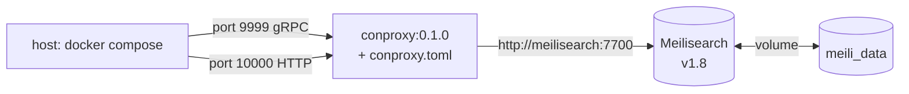

# Docker Compose

Quickest way to bring up conproxy + a backend on a single host. Run from
`examples/docker-compose/`:

```bash
docker compose up -d
curl -s http://127.0.0.1:10000/health
```

For the full step-by-step (customize, seed, troubleshoot), see
[`examples/docker-compose/README.md`](../examples/docker-compose/README.md).
This page covers the why behind the compose layout and the production gaps.

## Layout



Two services, one user-defined volume for Meilisearch. conproxy is stateless
and runs as the non-root `conproxy` user (uid 10001).

Meilisearch is chosen for the example because it's **text-native out of the
box** — no FastEmbed or local embedder configuration needed for the demo
flow. Swap it for Qdrant / Elasticsearch / pgvector (see
`examples/multi-upstream-cascade.toml`) when you want vector search.

## Service design choices

| Choice | Reason |
|--------|--------|
| Pinned image tags (`0.1.0`, `meilisearch v1.8`) | Reproducibility — `:latest` drifts |
| Meilisearch healthcheck + `depends_on: service_healthy` | Avoids race on first boot |
| `no-new-privileges` on conproxy | Cheap hardening, blocks trivial escalation |
| `restart: unless-stopped` on conproxy | Default for a long-running daemon |
| HTTP listen `0.0.0.0` (via CLI or `[server]`) | Required for Docker port-mapping |
| Upstream URL uses **Compose DNS name**, not `localhost` | Cross-service networking |
| Single user-defined volume (Meilisearch only) | conproxy is in-memory by default; add a volume if you enable `persistence` |

## Ports

| Port | Service | Used for |
|------|---------|----------|
| `9999` | conproxy gRPC | Programmatic query + admin |
| `10000` | conproxy HTTP | `/query`, `/health`, `/metrics`, `/cache/*`, `/admin/*` |
| `7700` | Meilisearch HTTP | (host-mapped for direct seeding via meili CLI / curl) |

## Customizing the image

For local builds (e.g. CI smoke of a PR), replace the image with a `build:`
key pointing at the repo root or your fork:

```yaml
services:
  conproxy:
    build:
      context: ../..
      dockerfile: Dockerfile
    # ...rest unchanged
```

This honors the same `release` feature flags baked into the published image
(`mcp` + `persistence` + `embed-api` + `pgvector`).

## Adding more services

Add `meilisearch`, `elasticsearch`, or `pgvector` blocks to the same file
and reference them by service name in `conproxy.toml`:

```yaml
  meilisearch:
    image: getmeili/meilisearch:v1.8
    environment:
      MEILI_NO_ANALYTICS: "true"
    ports: ["7700:7700"]
```

```toml
[upstreams.meili]
url = "http://meilisearch:7700"
type = "meilisearch"

[[contexts.default.upstreams]]
ref = "meili"
```

For a multi-leg cascade, see
[`examples/multi-upstream-cascade.toml`](../examples/multi-upstream-cascade.toml).

## Production gaps (what compose *won't* give you)

- **HA** — single instance; no leader election, no peer mesh
- **TLS** — gRPC/HTTP are plaintext on the Docker network; terminate at a
  reverse proxy or use `--cert` flags for mTLS on the proxy
- **Auth** — `proxy.api_key` is required only if you set one; compose does
  not ship one
- **Persistence** — in-memory cache only; restart = cold cache. Enable
  `persistence` (redb) and mount a volume for `/var/lib/conproxy/persist`
- **Backups** — Meilisearch data only; conproxy has none to back up
- **Observability** — add `--profile observability` and Prometheus/Grafana
  or scrape `/metrics` from a sidecar

For any of the above, use the
[Helm chart](https://github.com/jmcgrath207/conproxy/pkgs/container/charts%2Fconproxy)
or roll your own systemd/k8s manifests — see
[`deployment.md`](deployment.md).

## Troubleshooting

| Symptom | Likely cause | Fix |
|---------|--------------|-----|
| `conproxy` exits immediately | `conproxy.toml` parse error | `docker compose logs conproxy` |
| `connection refused` on `/query` | Listen on `127.0.0.1` inside container | `[server] listen = "0.0.0.0:9999"` (or pass `--listen`) |
| Qdrant unhealthy | Slow first boot / OOM | Increase `interval`/`retries`; check `docker compose logs qdrant` |
| Miss on every call | Empty Meilisearch index | Create the index + POST docs (see `examples/docker-compose/README.md`) |
| `results: []` even after seeding | Meilisearch adapter may need index-level `showRankingScore` setting; or scoring/filter threshold rejected all hits | Check `docker compose logs conproxy` for `normalized_score`, `result_count`. Try a single-keyword doc + simpler query to isolate. |
| Hit/miss ratio looks wrong | `cache_status` shape | See `/metrics` for `conproxy_cache_hit_rate` |

 **Known issue (v0.1.0 image):** the Meilisearch adapter defaulted to
`search_attributes: ["content"]`, so only the `content` field was searched.
Documents with `title`/`body` but no `content` returned 0 results even
though Meilisearch had matching docs. Fixed in this branch — empty
`search_fields` now searches all fields. If using the v0.1.0 image, set
`search_fields = ["title", "body", "content"]` in `conproxy.toml` or add
`"content"` to your documents.

## Reference

- [`examples/docker-compose/docker-compose.yml`](../examples/docker-compose/docker-compose.yml) — the runnable file
- [`examples/docker-compose/conproxy.toml`](../examples/docker-compose/conproxy.toml) — in-compose config
- [`deployment.md`](deployment.md) — production deploys (Docker + systemd + k8s)